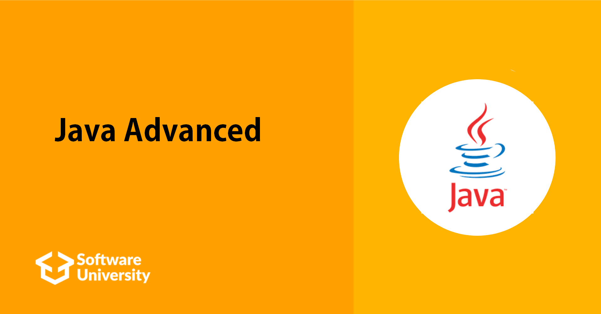

# Java Advanced January 2024

## Intro
Contains assignments from lectures and exercises from the SoftUni course.

To learn more about the course you can check [Softuni](https://softuni.bg/)

## Course topics

### Stacks and Queues
- [Lab](https://github.com/Dimitar-Peev/03.Java-Advanced-January-2024/tree/main/_01_StacksAndQueues/_01_Lab)
- [Exercise](https://github.com/Dimitar-Peev/03.Java-Advanced-January-2024/tree/main/_01_StacksAndQueues/_02_Exercise)

### Multidimensional Arrays
- [Lab](https://github.com/Dimitar-Peev/03.Java-Advanced-January-2024/tree/main/_02_MultidimensionalArrays/_01_Lab)
- [Exercise](https://github.com/Dimitar-Peev/03.Java-Advanced-January-2024/tree/main/_02_MultidimensionalArrays/_02_Exercise)

### Sets and Maps Advanced
- [Lab](https://github.com/Dimitar-Peev/03.Java-Advanced-January-2024/tree/main/_03_SetsAndMapsAdvanced/_01_Lab)
- [Exercise](https://github.com/Dimitar-Peev/03.Java-Advanced-January-2024/tree/main/_03_SetsAndMapsAdvanced/_02_Exercise)

### Streams, Files and Directories
- [Lab](https://github.com/Dimitar-Peev/03.Java-Advanced-January-2024/tree/main/_04_StreamsFilesAndDirectories/_01_Lab)
- [Exercise](https://github.com/Dimitar-Peev/03.Java-Advanced-January-2024/tree/main/_04_StreamsFilesAndDirectories/_02_Exercise)

### Functional Programming

### Defining Classes
- [Lab](https://github.com/Dimitar-Peev/03.Java-Advanced-January-2024/tree/main/_06_DefiningClasses/_01_Lab)

### Workshop

### Generics

### Iterators and Comparators

### Workshop: Algorithms Introduction

### Java Advanced - Exams
 - [Java Advanced Regular Exam - 26 Oct 2019](https://github.com/Dimitar-Peev/03.Java-Advanced-January-2024/tree/main/Java-Advanced-Exams/Java%20Advanced%20Regular%20Exam%20-%2026%20Oct%202019)
 - [Java Advanced Regular Exam - 22 Feb 2020](https://github.com/Dimitar-Peev/03.Java-Advanced-January-2024/tree/main/Java-Advanced-Exams/Java%20Advanced%20Regular%20Exam%20-%2022%20Feb%202020)
 - [Java Advanced Regular Exam - 28 June 2020](https://github.com/Dimitar-Peev/03.Java-Advanced-January-2024/tree/main/Java-Advanced-Exams/Java%20Advanced%20Regular%20Exam%20-%2028%20June%202020)
 - [Java Advanced Retake Exam - 18 August 2021](https://github.com/Dimitar-Peev/03.Java-Advanced-January-2024/tree/main/Java-Advanced-Exams/Java%20Advanced%20Retake%20Exam%20-%2018%20August%202021)